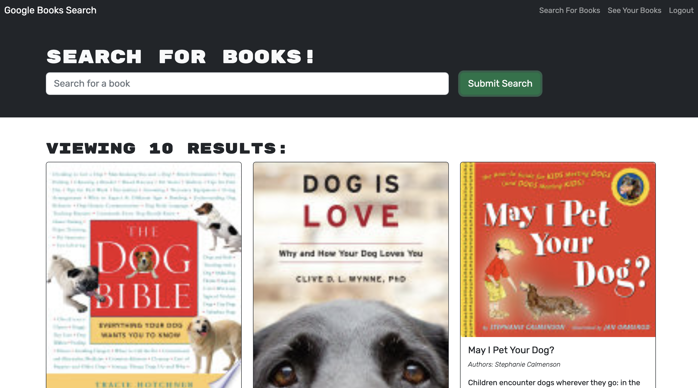

# 21 MERN: Book Search Engine

## Table of contents

- [Overview](#overview)
  - [The challenge](#the-challenge)
  - [Screenshot](#screenshot)
  - [Links](#links)
- [My process](#my-process)
  - [Built with](#built-with)
  - [Setup](#setup)
  - [What I learned](#what-i-learned)
- [Author](#author)

## Overview

### The challenge

In this project, we used the MERN stack (MongoDB, Express.js, React, and Node.js) to develop a web application with a RESTful API. However, as the application grew in complexity and data relationships became more intertwined, maintaining and scaling the REST API became increasingly challenging. To address these issues, we decided to transfer our RESTful API into a GraphQL API using Apollo Server.

With GraphQL, we were able to create a single endpoint that could handle multiple data requests, reducing the number of API calls required and improving performance. Additionally, the declarative nature of GraphQL made it easier for developers to understand the structure and relationships of the data, simplifying the development process and improving code maintainability.

To implement the GraphQL API, we used Apollo Server, a popular open-source GraphQL server that integrates seamlessly with the MERN stack. Apollo Server allowed us to define a schema that described the structure and relationships of our data, and provided tools for querying and mutating the data in the schema.

Overall, transferring our RESTful API into a GraphQL API using Apollo Server was a significant improvement for our application, making it easier to develop and scale, while also improving performance and maintainability.

### Screenshot

|     |
| :----------------------------------: |
| _↑ Google Books API Search Engine ↑_ |

|  |
| :-------------------------------: |
|          _↑ Save Book ↑_          |

### Links

- GitHub URL: [GitHub Repo](https://github.com/Andrew-TechMaster/MERN-BookSearchEngine-GraphQLAPI)
- Live Site URL: [https://secure-falls-02929.herokuapp.com/](https://secure-falls-02929.herokuapp.com/)

## My process

### Built with

- Cloud: Heroku
- Frontend: React
- Backend: Node, Express, GraphQL APIs
- Database: MongoDB
- Authentication: JSON Web Token
-

### Setup

> - To install dependencies, run "npm i"
>
> - To install the dependencies for both the frontend and backend, run the "npm run install" in the root directory of the project. This will install the necessary dependencies for both the client and server.
>
> - To run the app, you can use the command, "npm run develop", This command will start the development server for both the client and server simultaneously. This is useful for local development and testing.
> - Alternatively, you can use the command, "npm run start", to start the server only. This will start the server on its own and allow you to make requests to the API using a tool like Postman.
> - To build the production-ready version of the client, use the command: "npm run build". This command will create an optimized build of the client in the build directory.

> **Note**: Before deploying to a production environment, be sure to set the appropriate environment variables to ensure the app can connect to the necessary databases and APIs.

### What I learned

In this project, I learned about the benefits of using GraphQL to build APIs. GraphQL helps to solve the common issues of over-fetching and under-fetching data by allowing clients to specify exactly what data they need. This leads to more efficient data retrieval and reduces unnecessary network requests. I also appreciated the declarative nature of writing GraphQL queries and mutations, which made it easier to reason about the code and work with complex data structures. Additionally, the built-in type system of GraphQL provides a clear interface-like contract between the server and client, making it easier to understand and use the API without relying on external documentation. Overall, I found GraphQL to be a powerful and flexible tool for building modern web applications.

## Author

Andrew (Sheng-Chu), Chou

- Website - [Andrew Chou](https://andrew-techmaster.github.io/AndrewChou-Portfolio-React/)
- GitHub - [Andrew-TechMaster](https://github.com/Andrew-TechMaster)

---

© 2023 edX Boot Camps LLC. Confidential and Proprietary. All Rights Reserved.
